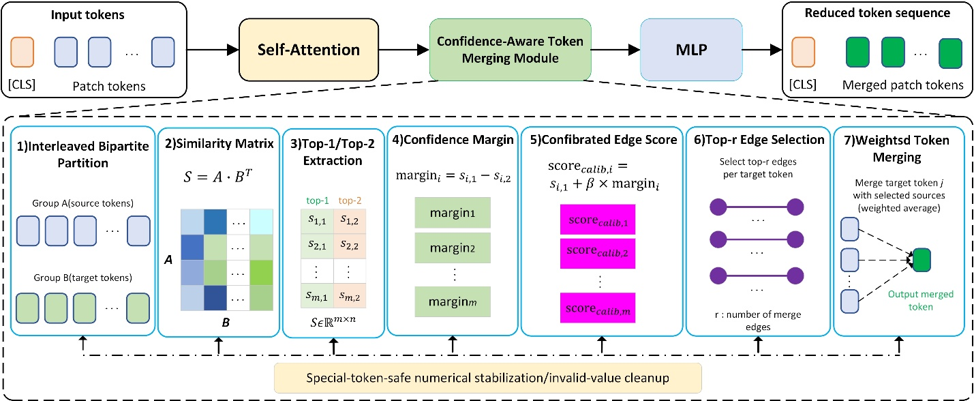

# Reliability-Guided Token Compression for Efficient Transformer-Based Visual Inference



This repository provides the source code, experimental protocols, testing metadata, and result tables associated with the manuscript:

**Reliability-Guided Token Compression for Efficient Transformer-Based Visual Inference**  
Submitted to **The Visual Computer**.

> **Software release DOI:** `Zenodo DOI: https://doi.org/10.5281/zenodo.20663724`
> **GitHub repository:** `https://github.com/Osiris-zou/Reliability-Guided-Token-Compression`  
> **Release version corresponding to the revised manuscript:** `v1.0.0`

The repository is organized to make the reported experiments reproducible while respecting the licenses and access conditions of third-party datasets and pretrained model checkpoints.

## Repository structure

```text
RGTC_Module/
├── classification/       # ImageNet-1K ViT/DeiT classification experiments
├── stable_diffusion/     # Stable Diffusion v1.5 generation experiments
└── segmentation/         # ADE20K Segmenter-B/16 transfer experiment
```

Each module contains its own `README.md`, environment file, dataset/checkpoint preparation notes, scripts, and final result tables.

## Method summary

The proposed method is a training-free reliability-guided refinement of ToMe-style token merging. It keeps the original bipartite partition, target assignment, token reduction schedule, and weighted aggregation rule, but modifies the source-edge ranking score by adding a top-1/top-2 matching-margin reliability term:

```text
calibrated_score = top1_similarity + beta * (top1_similarity - top2_similarity)
```

The implementation also includes special-token-aware numerical stabilization to avoid invalid `NaN` or `Inf` scores during margin computation and edge sorting.

## Key implementation files

### Classification

```text
classification/src/rgtc_classification/merge.py
classification/src/rgtc_classification/patch.py
classification/src/rgtc_classification/schedule.py
```

Main reproduction scripts:

```text
classification/scripts/evaluate_imagenet.py
classification/scripts/benchmark_throughput.py
classification/scripts/reproduce_table1_vit_fixed_beta.py
classification/scripts/reproduce_table1_vit_throughput.py
classification/scripts/reproduce_table2_deit_fixed_beta.py
classification/scripts/reproduce_table3_final_token_count.py
classification/scripts/reproduce_table4_paired_bootstrap.py
classification/scripts/reproduce_table5_beta_sensitivity.py
classification/scripts/reproduce_table6_stabilization_ablation.py
```

Final manuscript table sources:

```text
classification/results/final/table1_vit_fixed_beta.csv
classification/results/final/table1_vit_throughput.csv
classification/results/final/table2_deit_fixed_beta.csv
classification/results/final/table3_final_token_count.csv
classification/results/final/table4_paired_bootstrap.csv
classification/results/final/table5_beta_sensitivity.csv
classification/results/final/table6_stabilization_ablation.csv
```

### Stable Diffusion

```text
stable_diffusion/src/rgtc_sd/merging.py
stable_diffusion/src/rgtc_sd/pipeline.py
stable_diffusion/src/rgtc_sd/diffusion.py
```

Main reproduction scripts:

```text
stable_diffusion/scripts/generate_imagenet.py
stable_diffusion/scripts/evaluate_metrics.py
stable_diffusion/scripts/paired_stability.py
stable_diffusion/scripts/select_beta.py
stable_diffusion/scripts/prepare_fid_reference.py
```

Final manuscript table sources:

```text
stable_diffusion/results/final/metrics_summary.csv
stable_diffusion/results/final/paired_stability.csv
stable_diffusion/results/final/generation_log.csv
stable_diffusion/results/per_sample/pair_metrics_detail.csv
```

### ADE20K segmentation

```text
segmentation/scripts/evaluate_ade20k.py
segmentation/results/final/table_a1_ade20k_results.csv
segmentation/results/final/table_a1_ade20k_results.json
```

## Dependencies

The three experimental modules use separate environments to avoid version conflicts:

```bash
cd classification
conda env create -f environment.yml

cd ../stable_diffusion
conda env create -f environment.yml

cd ../segmentation
conda env create -f environment.yml
```

Each module README provides additional setup and execution instructions.

## Data and checkpoint availability

The following third-party datasets and checkpoints are not redistributed in this repository because they are subject to their original licenses and access conditions:

- ImageNet-1K validation images
- ADE20K validation images
- Stable Diffusion v1.5 checkpoint `v1-5-pruned-emaonly.ckpt`
- Stable Diffusion tokenizer files `vocab.json` and `merges.txt`
- Segmenter-B/16 ADE20K checkpoint

Instead, this repository provides:

- official dataset/checkpoint preparation instructions;
- prompt lists and random seeds used for Stable Diffusion generation;
- configuration files;
- final manuscript result tables;
- per-sample metric files where redistribution is allowed;
- paired bootstrap and stability-analysis inputs;
- scripts for rerunning the experiments after users obtain the required third-party data and checkpoints.

See the following files for details:

```text
classification/data/README.md
classification/checkpoints/README.md
stable_diffusion/checkpoints/README.md
segmentation/data/README.md
segmentation/checkpoints/README.md
```

## Reproducing the main tables

### Classification

```bash
cd classification
conda activate rgtc-classification
pip install -e .

python scripts/reproduce_table1_vit_fixed_beta.py
python scripts/reproduce_table1_vit_throughput.py --mode assemble
python scripts/reproduce_table2_deit_fixed_beta.py
python scripts/reproduce_table3_final_token_count.py
python scripts/reproduce_table4_paired_bootstrap.py
python scripts/reproduce_table5_beta_sensitivity.py
python scripts/reproduce_table6_stabilization_ablation.py --mode assemble
```

### Stable Diffusion

```bash
cd stable_diffusion
conda activate rgtc-sd
pip install -e .

python scripts/paired_stability.py \
  --pair-csv results/per_sample/pair_metrics_detail.csv \
  --out-csv results/final/paired_stability.csv \
  --out-md results/final/paired_stability.md \
  --out-detail-csv results/per_sample/pairwise_improvement_detail.csv
```

Full image generation and metric recomputation require the Stable Diffusion v1.5 checkpoint, tokenizer files, generated image folders, and an ImageNet-based FID reference folder. See `stable_diffusion/README.md`.

### ADE20K segmentation

```bash
cd segmentation
conda activate rgtc-segmentation
python scripts/evaluate_ade20k.py --help
```

The ADE20K experiment requires the official ADE20K validation set and Segmenter-B/16 checkpoint.

## Citation

If you use this code, experimental protocol, or released metadata, please cite the software release and the associated manuscript.

```bibtex
@software{zou2026reliability_guided_token_compression,
  author  = {Zou, Zhipeng and Zhang, Guowei and Han, Yong and Ke, Zhida},
  title   = {Reliability-Guided Token Compression for Efficient Transformer-Based Visual Inference},
  year    = {2026},
  version = {1.0.0},
  doi     = {<ZENODO-DOI>},
  url     = {<ZENODO-DOI-URL>},
  note    = {Software associated with a manuscript submitted to The Visual Computer}
}
```

Associated manuscript:

```text
Zou, Z., Zhang, G., Han, Y., and Ke, Z.
Reliability-Guided Token Compression for Efficient Transformer-Based Visual Inference.
Manuscript submitted to The Visual Computer.
```

The citation information will be updated with the final article DOI and bibliographic details if the manuscript is published.

## Third-party code and licenses

This repository contains or adapts components from ToMe, ToMeSD-style token merging, hkproj/pytorch-stable-diffusion, and Segmenter. Third-party licenses and notices are retained in the corresponding module directories. Users are responsible for checking the licenses of all third-party datasets, checkpoints, and code before use.
